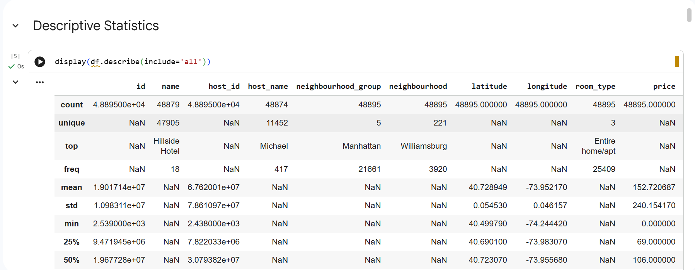
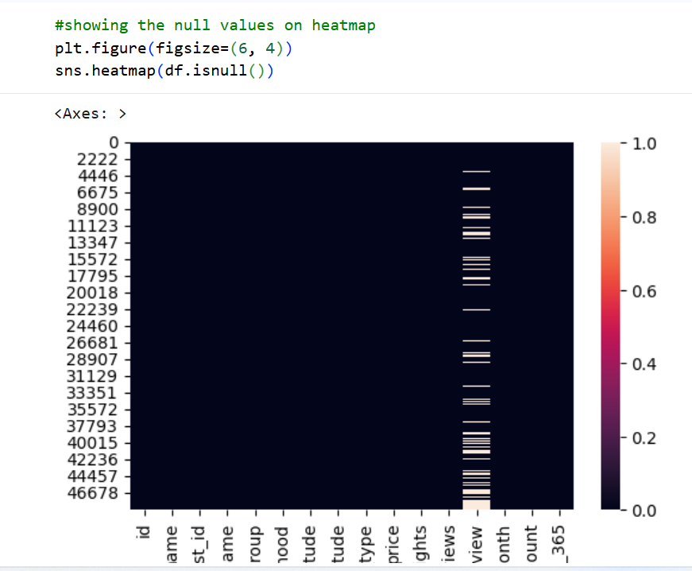
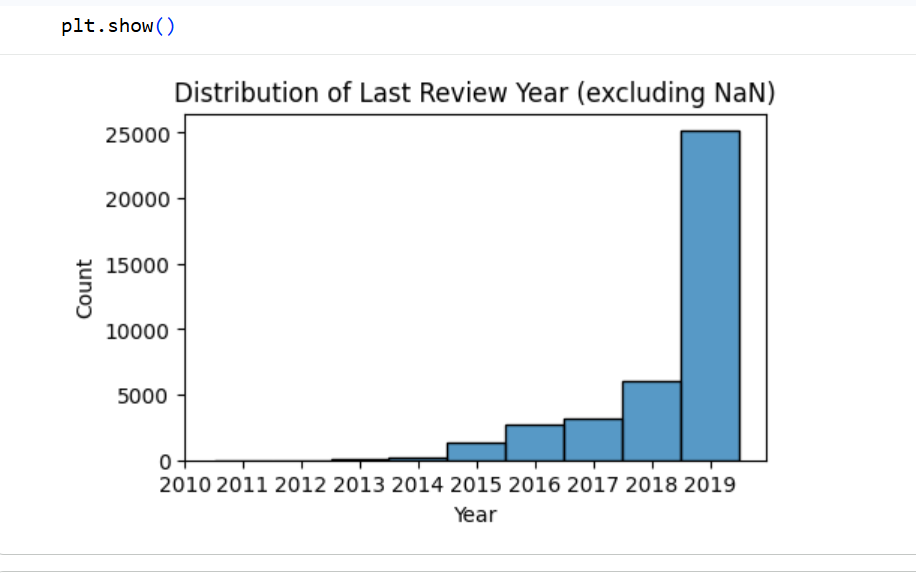

# NYC Airbnb 2019 Data Cleaning & Quality Analysis
This Python data analysis project cleaning the dataset, fixing or removing incorrect, corrupted, duplicate, or incomplete data within a dataset. Messy data leads to unreliable outcomes.


## 📌 Project Overview

This project focuses on **data cleaning and quality analysis** using the **New York City Airbnb 2019 dataset**. Real‑world datasets often contain missing values, duplicates, inconsistencies, and outliers that can negatively impact analysis and decision‑making.

The goal of this project is to systematically clean, standardize, and validate the dataset to ensure **high data integrity** and prepare it for reliable exploratory data analysis and future modeling tasks.

This project demonstrates practical data‑wrangling skills using Python and highlights common challenges encountered when working with real‑world data.

---

## 🎯 Project Objectives

This project addresses the following **Key Concepts and Challenges**:

* **Data Integrity**: Ensuring the accuracy, consistency, and reliability of data throughout the cleaning process.
* **Missing Data Handling**: Identifying missing values and applying appropriate strategies such as imputation or informed removal.
* **Duplicate Removal**: Detecting and eliminating duplicate records to maintain data uniqueness.
* **Standardization**: Applying consistent formatting, naming conventions, and data types across the dataset.
* **Outlier Detection**: Identifying and addressing extreme values that may skew analysis or reduce data quality.

### Learning Outcomes

* Develop strong data cleaning and preprocessing skills
* Gain hands‑on experience handling messy, real‑world datasets
* Learn best practices for ensuring data quality and integrity
* Prepare datasets for accurate analysis and visualization

---

## 🛠️ Tools and Libraries Used

The project was implemented using the following tools and Python libraries:

* **Python** – Core programming language
* **Google Colab** – Cloud‑based interactive development environment
* **Pandas** – Data manipulation and cleaning
* **NumPy** – Numerical operations
* **Matplotlib** – Data visualization
* **Seaborn** – Statistical data visualization

---

## 📂 Dataset Used

* **Original Dataset**: `AB_NYC_2019.csv`

  * Contains Airbnb listings in New York City for the year 2019
  * Includes features such as price, room type, neighborhood group, availability, number of reviews, and host information

* **Cleaned Dataset**: `AB_NYC_2019_cleaned.csv`

  * Missing values appropriately handled
  * Duplicate records removed
  * Inconsistent formats standardized
  * Outliers identified and treated

The cleaned dataset is suitable for reliable exploratory analysis and future machine learning workflows.

---

## 🔍 Analysis Summary

The data cleaning and analysis process followed a structured workflow:

1. **Initial Data Exploration**

   * Inspected dataset dimensions, data types, and column structure
   * Identified missing values and potential inconsistencies

2. **Data Cleaning**

   * Handled missing values in key columns using informed strategies
   * Removed duplicate records to ensure data uniqueness
   * Corrected inconsistent categorical values and formatting issues

3. **Standardization**

   * Standardized column names and data types
   * Ensured consistent units and value ranges across numerical features

4. **Outlier Detection & Treatment**

   * Identified extreme values in features such as price
   * Addressed outliers to minimize distortion in analysis

5. **Final Validation**

   * Rechecked dataset integrity after cleaning
   * Generated summary statistics to confirm data quality improvements

---

## 📊 Sample Visualizations

The project includes visualizations to support data quality assessment, such as:

* Distribution of Airbnb prices before and after cleaning
* Number of listings by neighborhood group
* Room type frequency comparison
* Box plots for outlier detection

Example outputs:

## 📈 Sample Visualizations

Below are some key visualizations from the analysis:






All other visualizations can be reproduced by running the notebook.

---

## ▶️ How to Run the Project

To run this project locally:

1. **Clone the repository**

   ```bash
   git clone https://github.com/Sanusi-Habeeb-Eniola/nyc-airbnb-data-cleaning.git
   ```

2. **Navigate to the project directory**

   ```bash
   cd nyc-airbnb-data-cleaning
   ```

3. **Install required dependencies**

   ```bash
   pip install pandas numpy matplotlib seaborn
   ```

4. **Open the Google Colab Notebook**

   ```bash
   Open the project in **Google Colab** and run all cells
   ```

5. **Run all cells** to reproduce the data cleaning and analysis process.

---

## 💡 Key Takeaways

* High‑quality data is critical for accurate analysis and modeling
* Systematic cleaning improves reliability and interpretability
* Outlier handling and standardization significantly enhance data usability
* Clean datasets form the foundation for effective data‑driven decision‑making

---

## 👤 Author

**Sanusi Habeeb Eniola**
Data Analyst | Data Cleaning & Quality Analysis | Python

---

⭐ *If you find this project useful, feel free to star the repository and connect!*
